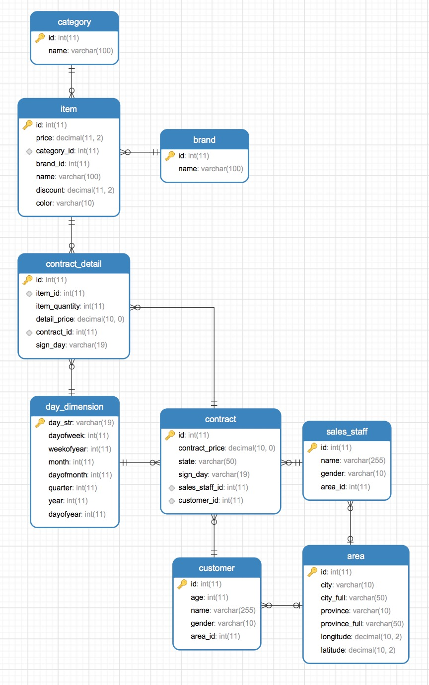

### 数据生成器

如果你在从事大数据BI的工作，想对比一下MySQL、GreenPlum、Elasticsearch、Hive、Presto、Impala、Drill、HAWQ、Druid、Pinot、Kylin、ClickHouse等不同实现方案之间的表现，那你就需要一份标准的数据进行测试，这个开源项目就是为了生成这样的标准数据。

数据模型：src/main/resources/数据模型.png

一、编译程序:

     mvn assembly:assembly

二、在MySQL中创建一个数据库，然后执行 src/main/resources/model_ddl.sql 创建对应的表。
     
三、指定ES的经纬度类型:

    curl -H "Content-Type: application/json" -XPUT 'http://192.168.252.193:9200/contract/contract/_bulk' -d '
    { "index":{ "_id": 1} }
    {"id":1}
    '
    
    curl -H "Content-Type: application/json" -XPUT 'http://192.168.252.193:9200/contract/_mapping/contract' -d '
    {
      "properties": {
        "geo_location": {
          "type": "geo_point"
        }
      }
    }
    '
    
    curl -H "Content-Type: application/json" -XPUT 'http://192.168.252.193:9200/detail/detail/_bulk' -d '
    { "index":{ "_id": 1} }
    {"id":1}
    '
    
    curl -H "Content-Type: application/json" -XPUT 'http://192.168.252.193:9200/detail/_mapping/detail' -d '
    {
      "properties": {
        "geo_location": {
          "type": "geo_point"
        }
      }
    }
    '
    
    curl -H "Content-Type: application/json" -XPUT 'http://192.168.252.193:9200/area/area/_bulk' -d '
    { "index":{ "_id": 1} }
    {"id":1}
    '
    
    curl -H "Content-Type: application/json" -XPUT 'http://192.168.252.193:9200/area/_mapping/area' -d '
    {
      "properties": {
        "geo_location": {
          "type": "geo_point"
        }
      }
    }
    '
    
    curl -H "Content-Type: application/json" -XPUT 'http://192.168.252.193:9200/customer/customer/_bulk' -d '
    { "index":{ "_id": 1} }
    {"id":1}
    '
    
    curl -H "Content-Type: application/json" -XPUT 'http://192.168.252.193:9200/customer/_mapping/customer' -d '
    {
      "properties": {
        "geo_location": {
          "type": "geo_point"
        }
      }
    }
    '
    
    curl -H "Content-Type: application/json" -XPUT 'http://192.168.252.193:9200/sales_staff/sales_staff/_bulk' -d '
    { "index":{ "_id": 1} }
    {"id":1}
    '
    
    curl -H "Content-Type: application/json" -XPUT 'http://192.168.252.193:9200/sales_staff/_mapping/sales_staff' -d '
    {
      "properties": {
        "geo_location": {
          "type": "geo_point"
        }
      }
    }
    '
     
四、在当前目录下的config.txt文件中指定配置:

    batchSize=1000
    startYear=2000
    startMonth=1
    startDay=1
    endYear=2018
    endMonth=4
    endDay=18
    #客户数
    customerCount=5000
    #销售数
    salesStaffCount=2000
    #合同数
    contractCount=20000
    #商品数
    itemCount=10000
    #商品价格上限
    priceLimit=1000
    #合同最大明细数
    contractDetailLimit=100
    #合同明细商品最大数量
    itemQuantityLimit=100
    #将生成的数据保存到哪个MySQL
    mysql.url=jdbc:mysql://192.168.252.193:3306/demo?useUnicode=true&characterEncoding=utf8
    mysql.user=root
    mysql.password=root
    mysql.pageSize=10000
    #将MySQL里面的数据查出来组装成JSON文档后索引到哪个ES
    es.host=192.168.252.193
    es.port=9200
    #ES批量提交数量
    es.batchSize=1000
    #可选值为file或者es
    #如果选择file，则在当前目录想生成相应的脚本文件，等程序执行完毕后再执行脚本文件将数据索引到ES
    #如果选择es，则在数据生成完毕后直接在程序中把数据提交给ES进行索引
    es.mode=es
    #是否异步多线程的方式进行ES索引
    output.async=true
    #如果是异步多线程的方式进行ES索引，则需要几个线程
    output.async.thread.count=10
    #如果ES索引中断，再次索引的时候从哪一页开始索引，0代表第一页
    output.start.page=0
    
五、运行程序:

all in one:

    nohup java -Xmx2g -Xms2g -cp data-generator-1.0-jar-with-dependencies.jar org.apdplat.data.generator.Start &

或者

step by step:

    1. 生成模拟数据并保存到mysql:

        nohup java -Xmx2g -Xms2g -cp data-generator-1.0-jar-with-dependencies.jar org.apdplat.data.generator.generator.Generator &

    2. 将mysql中的数据生成合同文档并提交给ES:

        nohup java -Xmx2g -Xms2g -cp data-generator-1.0-jar-with-dependencies.jar org.apdplat.data.generator.mysql2es.Contract &
        如果es.mode=es则不需要执行如下两步, 只有es.mode=file才需要执行
        chmod +x contract.sh
        nohup ./contract.sh &

    3. 将mysql中的数据生成合同明细文档并提交给ES:

        nohup java -Xmx2g -Xms2g -cp data-generator-1.0-jar-with-dependencies.jar org.apdplat.data.generator.mysql2es.ContractDetail &
        如果es.mode=es则不需要执行如下两步, 只有es.mode=file才需要执行
        chmod +x detail.sh
        nohup ./detail.sh &

    4. 将mysql中的数据生成区域文档并提交给ES:

        nohup java -Xmx1g -Xms1g -cp data-generator-1.0-jar-with-dependencies.jar org.apdplat.data.generator.mysql2es.Area &
        如果es.mode=es则不需要执行如下两步, 只有es.mode=file才需要执行
        chmod +x area.sh
        nohup ./area.sh &

    5. 将mysql中的数据生成商品文档并提交给ES:

        nohup java -Xmx2g -Xms2g -cp data-generator-1.0-jar-with-dependencies.jar org.apdplat.data.generator.mysql2es.Item &
        如果es.mode=es则不需要执行如下两步, 只有es.mode=file才需要执行
        chmod +x item.sh
        nohup ./item.sh &

    6. 将mysql中的数据生成客户文档并提交给ES:

        nohup java -Xmx2g -Xms2g -cp data-generator-1.0-jar-with-dependencies.jar org.apdplat.data.generator.mysql2es.Customer &
        如果es.mode=es则不需要执行如下两步, 只有es.mode=file才需要执行
        chmod +x customer.sh
        nohup ./customer.sh &

    7. 将mysql中的数据生成销售文档并提交给ES:

        nohup java -Xmx2g -Xms2g -cp data-generator-1.0-jar-with-dependencies.jar org.apdplat.data.generator.mysql2es.SalesStaff &
        如果es.mode=es则不需要执行如下两步, 只有es.mode=file才需要执行
        chmod +x sales_staff.sh
        nohup ./sales_staff.sh &

    8. 将mysql中的数据生成品牌文档并提交给ES:

        nohup java -Xmx2g -Xms2g -cp data-generator-1.0-jar-with-dependencies.jar org.apdplat.data.generator.mysql2es.Brand &
        如果es.mode=es则不需要执行如下两步, 只有es.mode=file才需要执行
        chmod +x brand.sh
        nohup ./brand.sh &

    9. 将mysql中的数据生成分类文档并提交给ES:

        nohup java -Xmx2g -Xms2g -cp data-generator-1.0-jar-with-dependencies.jar org.apdplat.data.generator.mysql2es.Category &
        如果es.mode=es则不需要执行如下两步, 只有es.mode=file才需要执行
        chmod +x category.sh
        nohup ./category.sh &

六、在hive中执行 src/main/resources/hive_ddl.sql 创建表。

七、执行 src/main/resources/sqoop.txt 中的命令将MySQL中的数据导入Hive。

八、在Kylin中导入Hive的表、创建Model和Cube、构建Cube。

九、在Kibana中创建索引模式，创建图表。

十、对MySQL、Kibana+ES、Kylin进行对比如下统计：

    SELECT
        item. NAME ,
        sum(contract_detail.price) AS total_price ,
        sum(contract_detail.item_quantity) AS total_quantity
    FROM
        contract_detail
    LEFT JOIN item ON contract_detail.item_id = item.id
    GROUP BY
        item. NAME
    ORDER BY
        total_quantity DESC 
        
    Kylin耗时0.5秒，MySQL59秒，ES5秒。